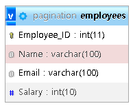
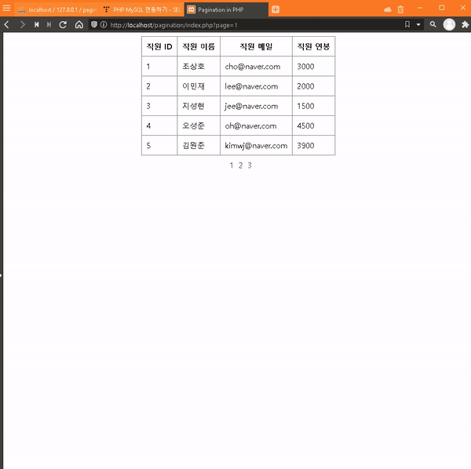

# How to Make Pagination in PHP

1. <https://www.youtube.com/watch?v=QP1jJlnC8eI&t=18s>

2. <https://youtu.be/md4FrSR_N_o>

3. 

4. 

## 소스 다운로드 후

1. 터미널 창에서 composer install 명령어 실행

2. .env.example 파일명을 .env로 변경하고 내부에 변숫값을 실제 사용하는 값으로 변경

3. phpmyadmin으로 들어가서 pagination 데이터베이스 생성 후 pagination.sql 가져오기로 한 번에 데이터 집어넣기
